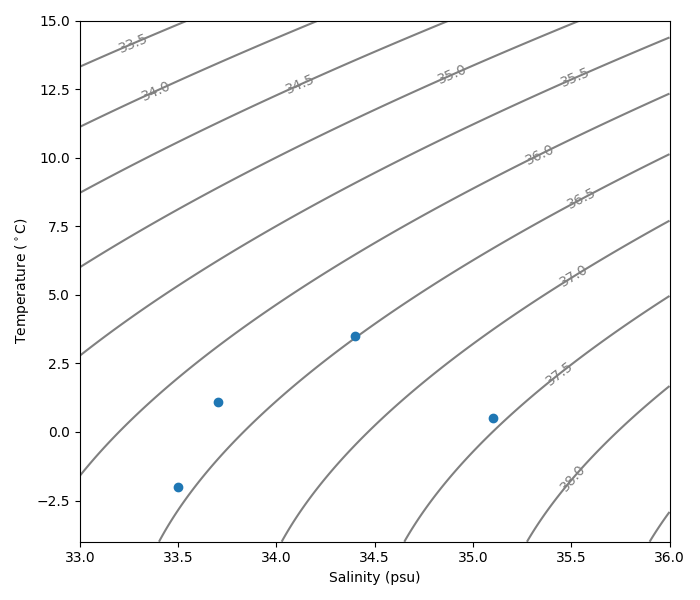

# Seawater Density

This generates a seawater density plot for a certain depth in the ocean. This figure can be customised for a certain 
depth, longitude, and latitude in the ocean. This currently calculates the sigma-2 density isopycnals but 

## PreRequisites

This will end up looking something like the below:

